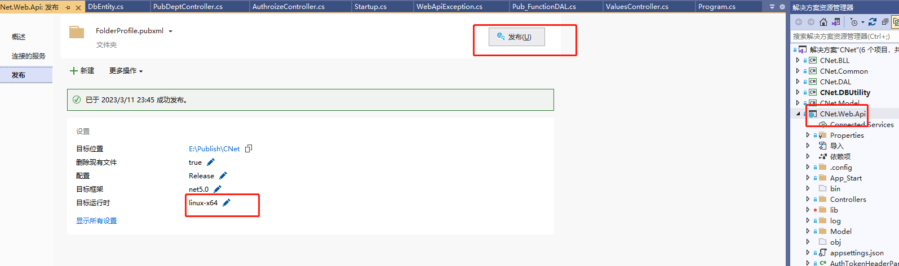

## <p align="center"> linux部署.Net </p>
----------------------------------------
### 一、环境部署
#### [1.  mysql](https://github.com/chi8708/Linux-.Net/blob/main/linux%E9%83%A8%E7%BD%B2mysql.md)
#### [2.  nginx](./linux%E9%83%A8%E7%BD%B2nginx.md)
#### [3.  .Net](./linux%E9%83%A8%E7%BD%B2.Net.md)
### 二、前后端分离项目部署
#### 本示例以[CNet权限管理系统](https://github.com/chi8708/CNet_Admin)为例
#### 1. 接口
- 1.1 运行依赖；linux服务器先 [安装.Net5 SDK](./linux%E9%83%A8%E7%BD%B2.Net.md),并配置成服务，开机启动。
若使用mysql [安装mysql](./linux%E9%83%A8%E7%BD%B2mysql.md)
- 1.2 修改启动文件Program.cs, 配置如下
```
public static IHostBuilder CreateHostBuilder(string[] args)
        {
            var configuration = new ConfigurationBuilder().AddJsonFile("appsettings.json").Build();


            var url = configuration["Urls"];
            return Host.CreateDefaultBuilder(args)
                .UseServiceProviderFactory(new AutofacServiceProviderFactory())//添加Autofac服务
                .ConfigureWebHostDefaults(webBuilder =>
                {
                    webBuilder.UseUrls(url);
                    webBuilder.UseStartup<Startup>();
                });
        }
```
- 1.3 配置运行端口：修改appsettings.json,添加节点` "Urls": "http://*:8916;"`
- 1.4 发布：选择项目点击右键发布

- 1.5 通过 xftp将项目复制到1.1服务配置对应目录下。（服务目录详细查看
 `systemctl status CNetWebapi  `,查看配置`cat -n /etc/systemd/system/CNetWebapi.service`）。
- 启动服务 `systemctl start CNetWebapi`
- 测试：`telnet 127.0.0.1 8916` 或`curl http://127.0.0.1:8916`
- 1.6 开放外网访问端口，云服务器可从web控制台操作。
#### 2. 前端代码
- 2.1 运行依赖；linux服务器先 [安装nginx](./linux%E9%83%A8%E7%BD%B2nginx.md)
- 2.2 目录切换 使用cmd或vscode，进入CNet.Web.Admin目录。
- 2.3 安装依赖运行命令：npm install。
- 2.4 发布：修改接口调用地址CNet.Web.Admin\src\config.js中的 pro节点。 运行npm run build。
- 2.5 通过xftp将发布文件dist上传到linux服务器。
- 2.6 查看 nginx目录`whereis nginx`。并配置nginx.conf
```
server {
        listen       8918;
        server_name  localhost;

        #charset koi8-r;

        #access_log  logs/host.access.log  main;

        location / {
            root   /home/wwwroot/CNet/dist;
            index  index.html index.htm;
        }
```
- 2.7 运行nginx 进入sbin目录./nginx
- 2.8 测试：`telnet 127.0.0.1 8918` 或 `curl http://127.0.0.1:8918`
- 2.9 开放外网访问端口，云服务器可从web控制台操作。