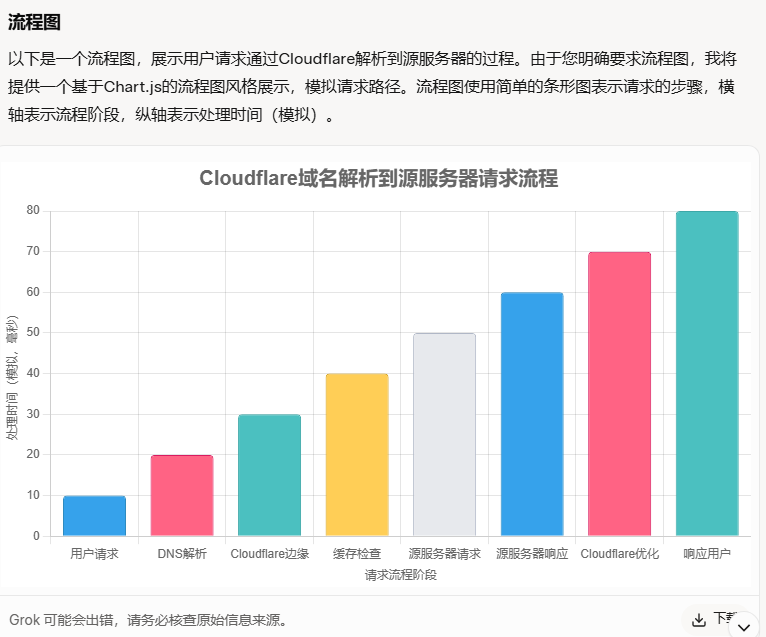
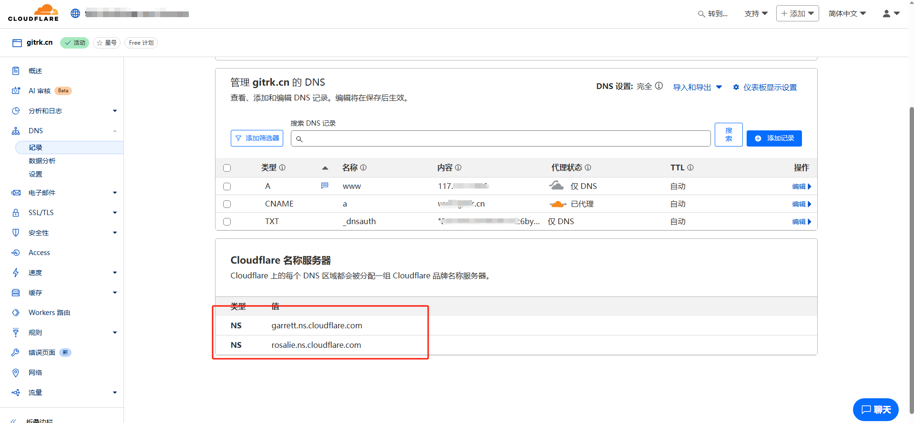
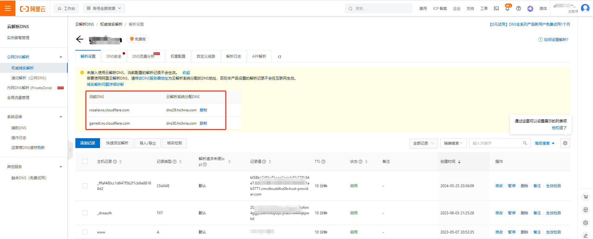
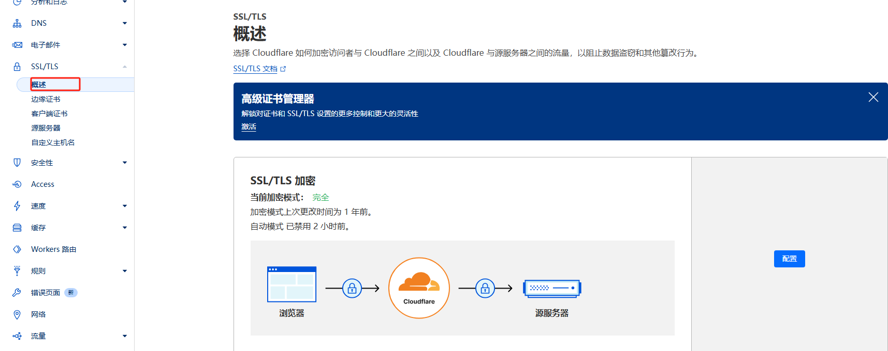
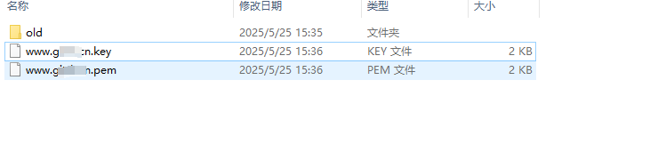
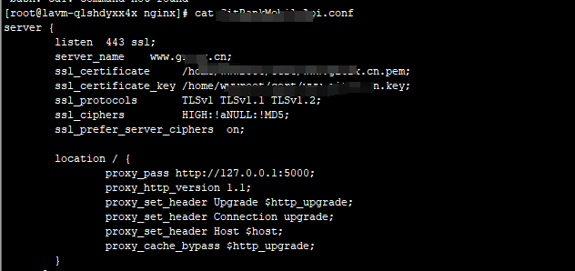
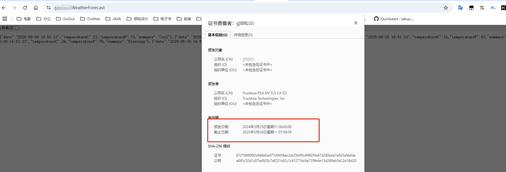
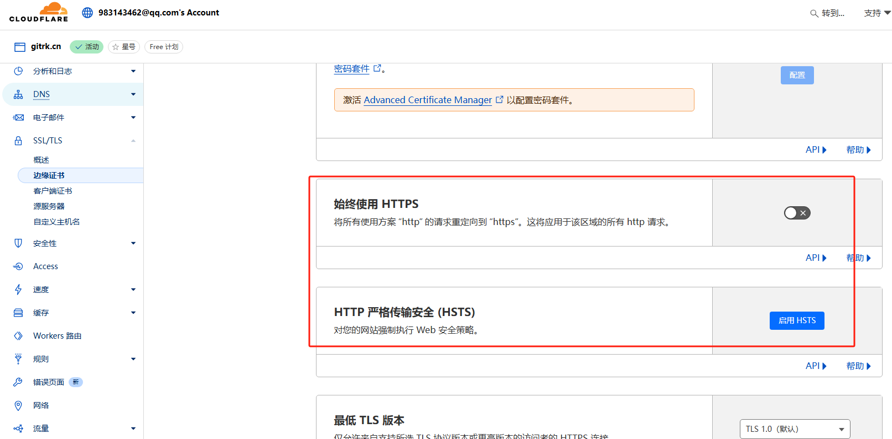

# 一、基础
1. **作用**：CDN加速，DNS管理与解析，网络安全防护：SSL、防DDOS攻击，缓存，安全防护，流量分析，API调用

# 二、 DNS解析
1. **DNS解析的原理**：将域名解析到Cloudflare的DNS服务器，然
后Cloudflare的DNS服务器将域名解析到实际的IP地址。
2. **流程图**

*阶段顺序：*
- 用户发起请求
- DNS解析到Cloudflare
- 请求到达Cloudflare边缘服务器
- 检查缓存
- 请求转发到源服务器
- 源服务器处理并响应
- Cloudflare优化响应
- 响应返回用户

 *补充说明*
- 缓存命中：如果第4步缓存命中，流程直接跳到第8步，减少延迟。
- 仅DNS模式：若未启用CDN，流程会跳过第3、4、7步，直接从DNS解析到源服务器。
- 实际延迟：Cloudflare的全球边缘节点（超过300个）显著降低延迟，实际时间因地理位置和配置不同而变化。
3. **配置步骤：**
   1. 登录Cloudflare控制台，进入DNS管理页面，点击“添加DNS记录”按钮。
   2. 在“添加DNS记录”页面中，输入域名和对应的IP地址，选择记录类型为A记录。
   
   3. 阿里云添加解析
   

# 三、使用https
1. 使用cloudflare的https服务，可以自动为网站启用https，提高网站的安全性。
2. **配置步骤：**
    1. A记录使用代理，使用后将使用边缘证书，http无法访问。
    1. 在cloudflare控制台，进入SSL/TLS概述页面，选择“完全”模式。
    
    2. 创建“边缘证书”（到期会自动创建），用于加密访问者和 Cloudflare。
    3. ~~创建“源服务器证书”，将内容保存未 www.yourdomain.com.key 和 www.yourdomain.com.pem。~~
    
    4. ~~将证书内容复制到服务器，并配置nginx~~
    

    5. 访问https://www.yourdomain.com，可以看到网站已经启用了https。
    

# 常见问题
1. ~~**Cloudflare配置ssl后导致http无法访问网站。**~~
    1. 检查DNS解析：A记录不要使用代理。
    2. 边缘证书配置：关闭“始终使用HTTPS”和HSTS传输.
    

